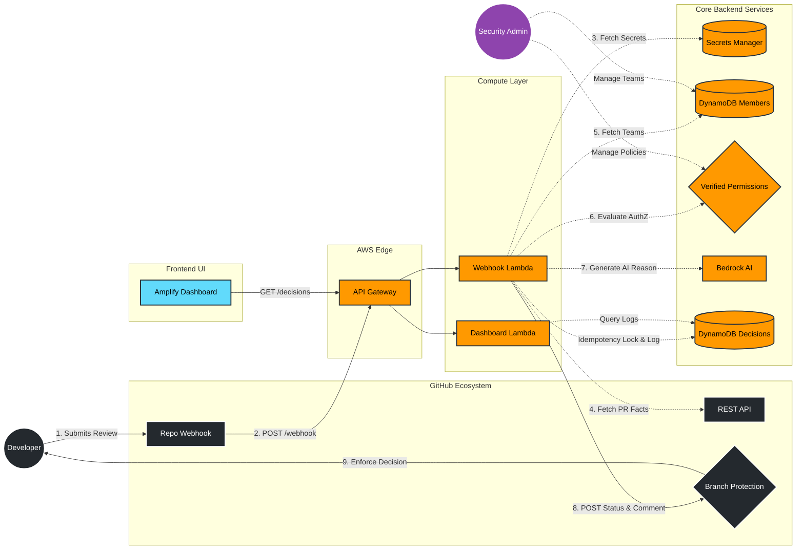

# Cedar Merge Gatekeeper. 
🚀 **[View Live Dashboard](https://main.d3ofi8gfbpsdj6.amplifyapp.com/)** | 🎥 **[Watch the Demo Video](https://youtu.be/61B4IXok6to)**

A serverless application that uses **AWS Verified Permissions** (Cedar) to evaluate complex pull request approvals that standard `CODEOWNERS` files cannot express. It acts as a dynamic merge gatekeeper, ensuring that code approvals comply with team hierarchy, file-path restrictions, and line-count thresholds before allowing code to merge.


## The Problem, and Who It's For

Standard GitHub `CODEOWNERS` can say "the security team owns `/src/auth/`." But it can't say "unless the PR is over 500 lines," "not if you wrote it yourself," or "let anyone in `engineering-core` self-serve everything else." Those are exactly the rules real teams reach for after they've been burned once — a rushed self-approval, an auth change that slipped through because the reviewer was junior, or a policy exception that needed a full PR-and-redeploy cycle just to grant.

Three people feel the difference directly when using this Gatekeeper:

- **The security lead**, who currently either writes a brittle CI script for every exception or just trusts review discipline to hold. With this, they change who's allowed to approve `/src/auth/*` from the AWS console — no PR, no redeploy, no waiting on a release window — and it's enforced on the very next pull request.
- **The engineer opening a PR**, who gets an immediate, specific reason on the check run and PR comment ("blocked — no self-approval" / "blocked — needs a senior reviewer") instead of a vague red X or forcing a human reviewer to be the bad guy.
- **The engineering manager**, who no longer needs a platform team to hand-build and maintain this kind of conditional access logic — it's a managed AWS service and a handful of Cedar policies, not custom internal tooling someone has to own forever.

The scope is deliberately narrow. That's the point: the live policy-edit-and-reflip we demo is the exact action a security lead would take mid-incident, not a staged trick.

## Security & Resilience Features
- **Strict Event Gating & Idempotency**: The gatekeeper ignores standard PR open/synchronize noise, safely triggering authorization evaluation *only* when a `pull_request_review` approval or a direct `merge` is submitted. Redelivered webhooks are caught via an `X-GitHub-Delivery` conditional-check lock in DynamoDB, ensuring exactly-once processing.
- **Fail-Closed API Fallbacks**: If the GitHub API rate-limits the Lambda or AWS Verified Permissions goes down, the gatekeeper falls back to a secure `NEUTRAL` degraded state in GitHub Check Runs (rather than failing open).
- **Exact Path Matching**: Python path validation accurately normalizes and enforces absolute path prefixing to ensure 1:1 parity with the Cedar `like "/src/auth/*"` schemas, preventing false-positive bypassed checks.
- **HMAC Hardened**: Full request signature validation verified comprehensively in unit tests.
- **Strict IAM Scoping**: Lambda execution roles aren't wildcards. DynamoDB reads/writes are strictly scoped to the exact table ARNs, Secrets Manager calls are scoped to the exact token ARNs, and AWS Verified Permissions `IsAuthorized` calls are scoped exclusively to `!GetAtt GatekeeperPolicyStore.Arn`.

## Advanced ABAC Cedar Rules Implemented
1. **Security Team Owns Auth**: Only members of `security-team` can approve/merge PRs touching `/src/auth/*`.
2. **Strict Ban on Self-Approvals**: `forbid` rules always override `permit` rules. Even if a Security Team member approves a `/src/auth/` PR, if they authored the PR, it is strictly blocked. (Explicitly proven in our unit test suite).
3. **General Engineers**: Can approve/merge anything outside of auth.
4. **Large PRs**: Any PR changing >500 lines mandates a `senior-engineers` approval.
5. **No Friday Merges**: Forbids Friday merges unless the PR is an explicit `isHotfix` AND the actor is a `senior-engineers` member.
6. **Weekend Infra Freeze**: Forbids `/terraform/*` changes on Saturday and Sunday (unless senior hotfix).
7. **Senior Break-Glass**: Permits `senior-engineers` to bypass path restrictions during a hotfix.
8. **Infrastructure Lockdown**: strictly locks down `/terraform/*` to `senior-engineers` 24/7.
## Learning

Coming into this build from a mostly FastAPI/PostgreSQL/Docker background, most of this stack was new ground:

- **A service we had never touched**: We had never used **Amazon Verified Permissions / Cedar** before Thursday. Writing policy-as-code with `permit`/`forbid` statements instead of `if user.role == ...` checks meant a totally different mental model, especially learning that a single `forbid` always wins over any `permit` regardless of order.
- **Local vs Cloud SDK differences**: We learned that testing with a local emulator library doesn't perfectly mirror the live AWS Boto3 SDK. Our biggest "why isn't this working" moment in the cloud was realizing the live AWS Verified Permissions response structure returns matching policies under the key `policyId`, while our local emulator expected `id`. That silent `KeyError` taught us why end-to-end testing in the real AWS environment is mandatory.
- **A first deploy**: Going from running things locally to an API Gateway → Lambda → DynamoDB architecture via AWS SAM was a massive first. Learning how to assign per-function IAM execution roles and pull secrets from AWS Secrets Manager instead of a local `.env` file was a huge step up in security.
- **A first agent**: We learned how to effectively pair-program alongside an autonomous AI agent (Antigravity). We used the agent not just as a code generator, but as a sparring partner to hunt down subtle logical gaps—like realizing our Python webhook used a loose substring match (`"auth/" in file`) which could fail-open on a file named `lib/oauth/helper.py`, while our Cedar policy demanded a strict prefix (`like "/src/auth/*"`). Together, we tightened the application code to perfectly mirror Cedar.
- **Deploying a secure frontend**: Even hosting a single static dashboard file taught us something. We initially considered an S3 Static Website, but realized it only serves over HTTP. To avoid a "Not Secure" Chrome warning during a security demo, we pivoted to **AWS Amplify** to deploy our frontend with full HTTPS in minutes.

## Architecture



1. **GitHub** sends a webhook event (PR or Review) to an **API Gateway**.
2. **AWS Lambda** validates the HMAC signature, then fetches paginated PR metadata (files changed, line counts) via the GitHub REST API.
3. **Lambda** looks up the actor's team memberships in **DynamoDB**.
4. **Lambda** constructs a request context and queries **AWS Verified Permissions** (Cedar) for authorization.
5. **Verified Permissions** returns an `ALLOW` or explicit `DENY` decision, attaching the specific policy ID that triggered the denial.
6. **Lambda** writes the decision to a secondary **DynamoDB Decisions Table**.
7. **Lambda** invokes **Amazon Bedrock (Amazon Nova Lite)** to generate a plain-English explanation for why the PR was approved or blocked, citing the exact Cedar policy.
8. **Lambda** updates the legacy **GitHub Commit Statuses API** (success/neutral/failure) and attaches the rich AI explanation payload to a Pull Request Comment.
9. A **Serverless UI Dashboard** (securely hosted on **AWS Amplify**) reads from the Decisions Table to visualize live metrics via Chart.js, chronologically sorted.

## Running it

```bash
# 1. Install dependencies
./scripts/setup.sh

# 2. Run the test suite (100% Passing)
make test

# 3. Deploy infrastructure via AWS SAM
make build && make deploy

# 4. Load Cedar schemas and policies into Verified Permissions
make load-policies
```

## Known Limitations & Security Boundaries
**GitHub Commit Statuses vs Check Runs API**
For this hackathon MVP, we deliberately utilized the legacy **GitHub Commit Statuses API** (`/statuses`) because it supports rapid prototyping using a Classic Personal Access Token (PAT). 

While AWS Verified Permissions operates flawlessly, the GitHub Commit Statuses API introduces a known trust boundary vulnerability: **Commit status contexts are not cryptographically bound to the identity that created them.** 
This means a malicious insider with standard `write` access to the repository could theoretically forge a passing status by sending a `POST` request to the `/statuses` endpoint using their own PAT and injecting our exact context label (`Cedar Merge Gatekeeper`), bypassing the branch protection rule.

**The Production Fix (Future Work)**
In a production rollout, this architecture must be migrated to a dedicated **GitHub App** utilizing the modern **Check Runs API** (`/check-runs`). Unlike legacy commit statuses, Check Runs are strictly bound to the specific GitHub App ID that created them. If a junior engineer attempts to forge a Check Run via the API, GitHub will instantly reject it because they do not possess the cryptographic private key belonging to the Gatekeeper GitHub App, rendering the architecture 100% tamper-proof at the GitHub boundary.

**Timezone Misalignment (UTC)**
Currently, the `dayOfWeek` calculation inside the AWS Lambda environment relies strictly on UTC time. This means that a developer in Asia Pacific may be prematurely blocked by the "No Friday Merges" rule if their Thursday evening overlaps with Friday UTC. In a production rollout, we would use the GitHub API to fetch the actor's profile timezone (or lookup team offsets in DynamoDB) to calculate a localized `dayOfWeek` offset.

**API Gateway Rate Limiting**
The webhook endpoint currently lacks strict throttling. While unauthorized requests are safely discarded via HMAC signature verification, a DDoS attack could still incur Lambda invocation and Secrets Manager costs. A production deployment would attach an **AWS WAF** (Web Application Firewall) to the API Gateway to block malicious IPs and configure a strict API Gateway Usage Plan with throttling constraints (e.g., 50 requests/second).
## How to use this on your own GitHub Repository
Once you have deployed the AWS SAM stack, you can attach this gatekeeper to any GitHub repository:

1. **Get your API URL**: After running `make deploy`, note the `ApiUrl` in the CloudFormation output.
2. **Add the Webhook in GitHub**: 
   - Navigate to your repository on GitHub -> **Settings** -> **Webhooks** -> **Add webhook**.
   - **Payload URL**: Paste your `ApiUrl`.
   - **Content type**: Select `application/json`.
   - **Secret**: Enter the secret string you stored in your AWS Secrets Manager (`GitHubWebhookSecret`).
   - **Which events**: Select "Let me select individual events", and check **Pull requests** and **Pull request reviews**.
3. **Provide a GitHub Token**: Ensure your `GitHubTokenSecret` in AWS Secrets Manager contains a valid GitHub Personal Access Token (or GitHub App token) with permissions to read Pull Requests and write Check Runs/Comments.
4. **Enforce the Gatekeeper**: This is the most critical step to actually block merges! 
   - Go to **Settings** -> **Branches** -> **Add branch protection rule**.
   - Set the Branch name pattern (e.g., `main`).
   - Check **Require status checks to pass before merging**.
   - Search for and select **Cedar Merge Gatekeeper** to make it required.
   - Now, a `DENY` decision from AWS Verified Permissions will physically disable the "Merge pull request" button!

## AI Tool Disclosure
In compliance with hackathon rules, we disclose the use of the following AI tools used during the planning and build process:
- **Google Deepmind's Agentic Assistant (Antigravity)**: Used extensively for architectural planning, drafting the Cedar schema, mocking the AWS API integrations during local testing, and structuring our deployment scripts.
- **Anthropic's Claude**: Used as a strategic sparring partner to pressure-test the authorization logic, identify critical fail-open vulnerabilities, formulate the narrative for the Learning/Impact sections, and decide on the Amplify hosting pivot.

## Third-Party Libraries & Licenses
- **Chart.js** (MIT License): Used in the `dashboard/index.html` file to render the decision distribution doughnut chart.
- **TailwindCSS** (MIT License): Used via CDN for rapid styling of the dashboard UI.
- **Feather Icons** (MIT License): Used for SVG iconography in the dashboard.
